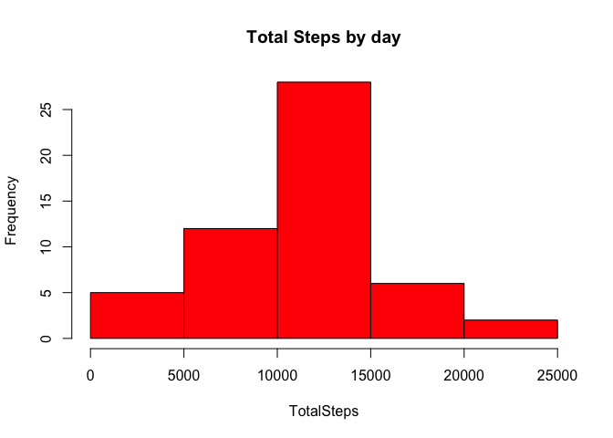
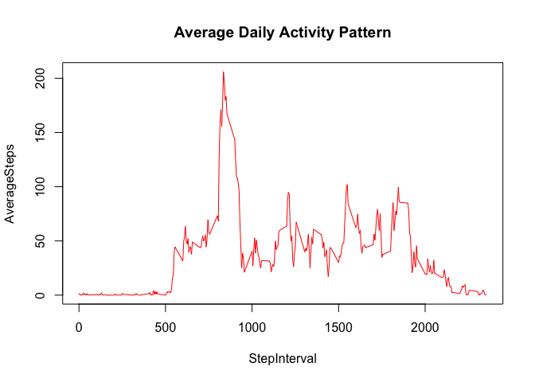
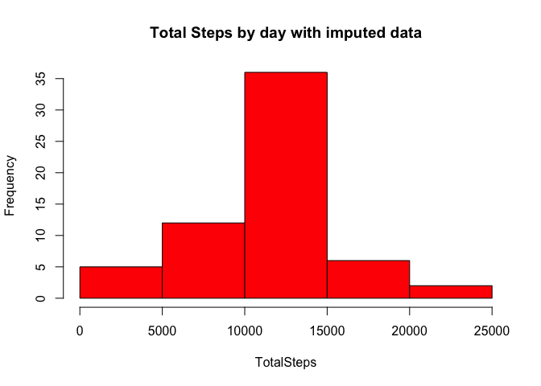
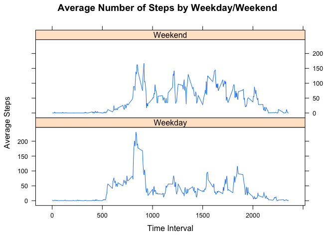

## Loading and preprocessing the data

```r
library(gtools)
inittbl <- read.csv("activity.csv",header = TRUE, sep = ",")
inittbl$date <- as.Date(inittbl$date)
clntbl <- na.omit(inittbl)
head(clntbl)
```

```
##     steps       date interval
## 289     0 2012-10-02        0
## 290     0 2012-10-02        5
## 291     0 2012-10-02       10
## 292     0 2012-10-02       15
## 293     0 2012-10-02       20
## 294     0 2012-10-02       25
```


## What is mean total number of steps taken per day?

```r
totSteps<-aggregate(clntbl$steps,by=list(clntbl$date),sum)
colnames(totSteps)<-c("Date","TotalSteps")
with(totSteps,hist(TotalSteps,main="Total Steps by day",col="red"))
```

<!-- -->

Calculate Mean steps

```r
mean(totSteps$TotalSteps)
```

```
## [1] 10766.19
```

Calculate Median steps

```r
median(totSteps$TotalSteps)
```

```
## [1] 10765
```
## What is the average daily activity pattern?

```r
totPattern<-aggregate(clntbl$step,by=list(clntbl$interval),mean)
colnames(totPattern)<-c("StepInterval","AverageSteps")
maxSteps<-which.max(totPattern$AverageSteps)
with(totPattern,plot(totPattern,main="Average Daily Activity Pattern",col="red",type="l"))
```

<!-- -->

Interval with the max steps

```r
totPattern[maxSteps,]
```

```
##     StepInterval AverageSteps
## 104          835     206.1698
```


## Imputing missing values
How many values are missing

```r
sum(is.na(inittbl$steps))
```

```
## [1] 2304
```

Strategy for missing values: Missing values will be to use the mean steps for the time interveral across the timeframe and insert that for missing values.

Create new dataset equal to the the original dataset with missing data filled in.

```r
colnames(totPattern)<-c("interval","AverageSteps")
imputedtbl <- merge(inittbl,totPattern, by="interval")

NAs <- is.na(imputedtbl$steps)
summary(NAs)
```

```
##    Mode   FALSE    TRUE 
## logical   15264    2304
```

```r
imputedtbl$steps[NAs] <- imputedtbl$AverageSteps[NAs]
imputedtbl <- imputedtbl[,c(1:3)]
```

Histogram of total number steps after missing values are imputed

```r
totStepsImp<-aggregate(imputedtbl$steps,by=list(imputedtbl$date),sum)
colnames(totStepsImp)<-c("Date","TotalSteps")
with(totStepsImp,hist(TotalSteps,main="Total Steps by day with imputed data",col="red"))
```

<!-- -->

Calculate Mean and median for Imputed

```r
mean(totStepsImp$TotalSteps)
```

```
## [1] 10766.19
```

```r
median(totStepsImp$TotalSteps)
```

```
## [1] 10766.19
```

###Are there differences from the first part of the assignment?

The mean is the same. The median is slightly higher by a step.

## Are there differences in activity patterns between weekdays and weekends?

```r
weektbl<-imputedtbl[!((weekdays(imputedtbl$date) %in% c("Saturday","Sunday"))),]
weekendtbl<-imputedtbl[(weekdays(imputedtbl$date)) %in% c("Saturday","Sunday"),]

#plot both weekday and weekend activity
weektbl<-aggregate(weektbl$step,by=list(weektbl$interval),mean)
colnames(weektbl)<-c("StepInterval","AverageSteps")
maxSteps<-which.max(weektbl$AverageSteps)
weekendtbl<-aggregate(weekendtbl$step,by=list(weekendtbl$interval),mean)
colnames(weekendtbl)<-c("StepInterval","AverageSteps")
weektbl$daytype <- "Weekday"
weekendtbl$daytype <- "Weekend"
combineddata = smartbind(weektbl,weekendtbl)
library(lattice)
finalplot <- xyplot(AverageSteps ~ StepInterval | daytype, data=combineddata,type="l", layout=c(1,2), main = "Average Number of Steps by Weekday/Weekend", ylab="Average Steps", xlab="Time Interval")
finalplot
```

<!-- -->

Yes there are differences in activity patterns between weekend and weekdays. During the weekend there is more consistent activity during the day. During the weekday most of the activity is early on in the day, perhaps with people excercising before heading to work. 
